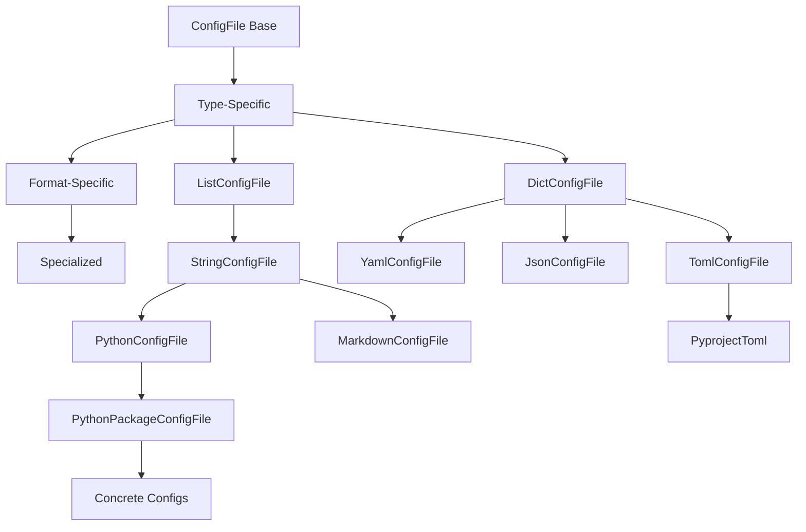
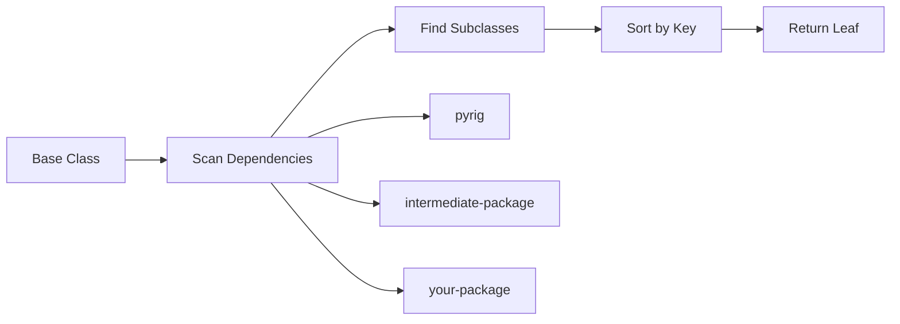

## Overview

pyrig is built around three interconnected systems that enable powerful extensibility and automation:

<CardGroup cols={3}>
  <Card title="Config System" icon="file-code">
    Declarative file management with automatic discovery and merging
  </Card>
  <Card title="CLI System" icon="terminal">
    Automatic command registration across package dependencies
  </Card>
  <Card title="Inheritance System" icon="layer-group">
    Multi-package inheritance with automatic discovery (`.I` and `.L` patterns)
  </Card>
</CardGroup>

## Config File System

### The ConfigFile Architecture

Every generated file in pyrig is backed by a `ConfigFile` subclass. This provides:

- **Automatic discovery**: All ConfigFile subclasses are found across dependent packages
- **Subset validation**: User files only need required keys, not all keys
- **Intelligent merging**: pyrig adds missing keys while preserving user additions
- **Priority-based validation**: Files validate in order (e.g., pyproject.toml before dependent configs)
- **Parallel execution**: File validation runs concurrently for performance

### How ConfigFile Works

Here's the complete lifecycle:

<Steps>
  <Step title="Define expected configuration">
    Create a ConfigFile subclass that declares what should exist:

    ```python
    from pathlib import Path
    from pyrig.rig.configs.base.toml import TomlConfigFile

    class MyConfigFile(TomlConfigFile):
        def parent_path(self) -> Path:
            return Path()  # Project root

        def _configs(self) -> dict:
            return {
                "tool": {
                    "myapp": {
                        "version": "1.0.0",
                        "debug": False
                    }
                }
            }

        def priority(self) -> float:
            return 50  # Validate after pyproject.toml
    ```
  </Step>

  <Step title="Run validation">
    When `pyrig mkroot` runs, for each ConfigFile:

    1. **Load existing file** (if it exists)
    2. **Merge configurations**: `user_config | expected_config`
    3. **Validate subset**: Ensure `expected_config ⊆ merged_config`
    4. **Write back**: Save merged config (user additions preserved)
  </Step>

  <Step title="Opt-out behavior">
    Users can opt-out by creating an empty file:

    ```bash
    # Opt out of my-config.toml
    touch my-config.toml
    ```

    Empty files are left unchanged by validation.
  </Step>
</Steps>

### ConfigFile Hierarchy

The system has four layers:



<Tabs>
  <Tab title="Core Layer">
    **ConfigFile** (`base.py`)

    Abstract base defining the config lifecycle:

    ```python
    class ConfigFile[ConfigT]:
        @abstractmethod
        def parent_path(self) -> Path:
            """Directory containing the file."""

        @abstractmethod
        def _configs(self) -> ConfigT:
            """Expected configuration."""

        @abstractmethod
        def _load(self) -> ConfigT:
            """Load and parse file."""

        @abstractmethod
        def _dump(self, config: ConfigT) -> None:
            """Write configuration."""
    ```
  </Tab>

  <Tab title="Type-Specific Layer">
    **DictConfigFile** and **ListConfigFile**

    Handle dict vs list-based configs:

    ```python
    class DictConfigFile(ConfigFile[ConfigDict]):
        def merge_configs(
            self, user: ConfigDict, expected: ConfigDict
        ) -> ConfigDict:
            return user | expected
    ```
  </Tab>

  <Tab title="Format-Specific Layer">
    **TomlConfigFile**, **YamlConfigFile**, etc.

    Implement format-specific parsing:

    ```python
    class TomlConfigFile(DictConfigFile):
        def extension(self) -> str:
            return "toml"

        def _load(self) -> ConfigDict:
            return tomlkit.load(self.path().open())

        def _dump(self, config: ConfigDict) -> None:
            tomlkit.dump(config, self.path().open("w"))
    ```
  </Tab>

  <Tab title="Specialized Layer">
    **PythonPackageConfigFile**, **WorkflowConfigFile**, etc.

    Domain-specific configurations:

    ```python
    class PythonPackageConfigFile(PythonConfigFile):
        def parent_path(self) -> Path:
            # Ensures parent is a valid package
            parent = super().parent_path()
            parent.mkdir(parents=True, exist_ok=True)
            return parent
    ```
  </Tab>
</Tabs>

### Subset Validation

The key innovation is **subset validation** rather than exact matching:

```python
def nested_structure_is_subset(subset: dict, superset: dict) -> bool:
    """Check if subset structure exists within superset."""
    for key, value in subset.items():
        if key not in superset:
            return False
        if isinstance(value, dict):
            if not nested_structure_is_subset(value, superset[key]):
                return False
        elif superset[key] != value:
            return False
    return True
```

This allows:
- **User additions**: Extra keys beyond expected config
- **Required structure**: Expected keys must exist with correct values
- **Validation**: Final file must contain all expected configuration

### Example: pyproject.toml

```python pyrig/rig/configs/pyproject.py
class PyprojectToml(TomlConfigFile):
    def parent_path(self) -> Path:
        return Path()

    def _configs(self) -> ConfigDict:
        return {
            "project": {
                "name": PackageName.I.name,
                "version": "0.1.0",
                "dependencies": ["typer>=0.21.1"],
            },
            "build-system": {
                "requires": ["uv_build"],
                "build-backend": "uv_build",
            },
        }

    def priority(self) -> float:
        return 100  # Validate first
```

When you run `pyrig mkroot`:
1. Loads existing `pyproject.toml`
2. Merges with expected structure
3. Preserves your custom dependencies, scripts, etc.
4. Ensures required fields exist
5. Writes back merged result

## CLI System

### Automatic Command Discovery

The CLI system automatically discovers and registers commands from three sources:

<Steps>
  <Step title="Main entry point">
    **`main()` from `<package>.main`**

    ```python my_project/main.py
    def main() -> None:
        """Run the main entrypoint for the project."""
        print("Hello from my project!")
    ```

    Registered as the default command (package name).
  </Step>

  <Step title="Project-specific commands">
    **Functions from `<package>.rig.cli.subcommands`**

    ```python my_project/rig/cli/subcommands.py
    def deploy() -> None:
        """Deploy the application."""
        # Deployment logic
    ```

    ```bash
    uv run my-project deploy
    ```
  </Step>

  <Step title="Shared commands">
    **Functions from `<package>.rig.cli.shared_subcommands` across all packages**

    ```python my_project/rig/cli/shared_subcommands.py
    def version() -> None:
        """Display project version."""
        project_name = project_name_from_argv()
        print(f"{project_name} version {_version(project_name)}")
    ```

    Available in all dependent projects automatically.
  </Step>
</Steps>

### CLI Registration Flow

Here's how the CLI discovers and registers commands:

```python pyrig/rig/cli/cli.py (simplified)
app = typer.Typer()

def add_subcommands() -> None:
    # Extract package name from sys.argv[0]
    package_name = package_name_from_argv()

    # 1. Register main() from <package>.main
    main_module = import_module(f"{package_name}.main")
    app.command()(main_module.main)

    # 2. Register functions from <package>.rig.cli.subcommands
    subcommands = import_module(f"{package_name}.rig.cli.subcommands")
    for func in all_functions_from_module(subcommands):
        app.command()(func)

def add_shared_subcommands() -> None:
    package_name = package_name_from_argv()
    package = import_module(package_name)

    # 3. Find all packages in dependency chain (pyrig -> ... -> current)
    all_modules = discover_equivalent_modules_across_dependents(
        shared_subcommands, pyrig, until_package=package
    )

    # Register all functions from each module
    for module in all_modules:
        for func in all_functions_from_module(module):
            app.command()(func)
```

### Logging Configuration

The CLI includes flexible verbosity control:

<Tabs>
  <Tab title="Default">
    ```bash
    uv run pyrig mkroot
    ```
    INFO level, clean formatting (just messages)
  </Tab>
  <Tab title="Quiet (-q)">
    ```bash
    uv run pyrig -q mkroot
    ```
    WARNING level (errors and warnings only)
  </Tab>
  <Tab title="Verbose (-v)">
    ```bash
    uv run pyrig -v mkroot
    ```
    DEBUG level with level prefix
  </Tab>
  <Tab title="Very Verbose (-vv)">
    ```bash
    uv run pyrig -vv mkroot
    ```
    DEBUG level with module names
  </Tab>
  <Tab title="Maximum (-vvv)">
    ```bash
    uv run pyrig -vvv mkroot
    ```
    DEBUG level with timestamps and full details
  </Tab>
</Tabs>

## Multi-Package Inheritance System

### The `.I` and `.L` Patterns

The most powerful feature of pyrig is automatic discovery of implementations across package boundaries.

#### DependencySubclass Base

All extensible classes inherit from `DependencySubclass`:

```python pyrig/src/subclass.py
class DependencySubclass(ABC):
    @classmethod
    @abstractmethod
    def definition_package(cls) -> ModuleType:
        """Package where implementations live."""

    @classmethod
    @abstractmethod
    def sorting_key(cls, subclass: type[T]) -> Any:
        """Sort key for ordering discovered subclasses."""

    @classproperty
    @cache
    def L(cls: type[Self]) -> type[Self]:
        """Get the final leaf subclass (deepest in inheritance tree)."""
        # Discovery logic...

    @classproperty
    @cache
    def I(cls: type[Self]) -> Self:
        """Get an instance of the final leaf subclass."""
        return cls.L()
```

### How It Works

<Steps>
  <Step title="Define base class">
    ```python pyrig/rig/tools/package_manager.py
    class PackageManager(Tool):
        def name(self) -> str:
            return "uv"

        def install_dependencies_args(self) -> Args:
            return self.args("sync")
    ```
  </Step>

  <Step title="Override in your package">
    ```python my_project/rig/tools/package_manager.py
    from pyrig.rig.tools.package_manager import PackageManager

    class MyPackageManager(PackageManager):
        def install_dependencies_args(self) -> Args:
            return self.args("sync", "--frozen")
    ```
  </Step>

  <Step title="Access automatically">
    ```python
    # Anywhere in the codebase
    PackageManager.I.install_dependencies_args()
    # Uses MyPackageManager implementation automatically!
    ```
  </Step>
</Steps>

### Discovery Process



The discovery searches:
1. **Base dependency** (typically `pyrig`)
2. **All dependent packages** in the dependency chain
3. **Scoped to definition package** (e.g., `rig.tools`)
4. **Returns leaf** (most specific implementation)

### Practical Example: Tool Wrappers

```python pyrig/rig/tools/base/base.py
class Tool(DependencySubclass):
    @abstractmethod
    def name(self) -> str:
        """Tool command name."""

    def args(self, *args: str) -> Args:
        """Build Args object from command parts."""
        return Args((self.name(), *args))

    @classmethod
    def definition_package(cls) -> ModuleType:
        return tools  # pyrig.rig.tools
```

All tools inherit this pattern:

<CodeGroup>
```python Linter
class Linter(Tool):
    def name(self) -> str:
        return "ruff"

    def check_args(self) -> Args:
        return self.args("check")

# Usage:
Linter.I.check_args().run()
```

```python TypeChecker
class TypeChecker(Tool):
    def name(self) -> str:
        return "ty"

    def check_args(self) -> Args:
        return self.args("check")

# Usage:
TypeChecker.I.check_args().run()
```

```python PackageManager
class PackageManager(Tool):
    def name(self) -> str:
        return "uv"

    def sync_args(self) -> Args:
        return self.args("sync")

# Usage:
PackageManager.I.sync_args().run()
```
</CodeGroup>

### Creating Organization Standards

The real power emerges when creating organization-wide standards:

```python company-pyrig/rig/tools/linter.py
from pyrig.rig.tools.linter import Linter

class CompanyLinter(Linter):
    def check_args(self) -> Args:
        # Add company-specific rules
        return self.args("check", "--config", "company-rules.toml")
```

Now any project that depends on `company-pyrig` automatically uses company rules:

```toml any-project/pyproject.toml
[project]
dependencies = [
    "company-pyrig",  # All company standards applied
]
```

## Benefits of This Architecture

<CardGroup cols={2}>
  <Card title="Declarative" icon="file-lines">
    Define what should exist, not how to create it. pyrig handles the implementation.
  </Card>
  <Card title="Idempotent" icon="arrows-rotate">
    Safe to run repeatedly. Changes are preserved, missing structure is added.
  </Card>
  <Card title="Extensible" icon="puzzle-piece">
    Override any behavior by subclassing. Changes propagate automatically.
  </Card>
  <Card title="Discoverable" icon="magnifying-glass">
    All implementations found automatically. No manual registration needed.
  </Card>
  <Card title="Composable" icon="layer-group">
    Build on existing standards. Company package extends pyrig, project extends company package.
  </Card>
  <Card title="Type-Safe" icon="shield-check">
    Full type checking support. IDE autocomplete works throughout.
  </Card>
</CardGroup>

## Design Principles

### 1. Separation of Concerns

- **ConfigFile**: Declares what files should exist
- **Tool**: Constructs command arguments
- **Builder**: Creates build artifacts
- **CLI**: Routes commands to implementations

Each system is independent but composable.

### 2. Discovery Over Registration

No manual registration required. Define a subclass and it's automatically discovered:

```python
# This is all you need
class MyConfig(TomlConfigFile):
    # Implementation
```

Compare to manual registration:
```python
# What you DON'T need to do
register_config(MyConfig)  # Not needed!
CONFIG_REGISTRY.append(MyConfig)  # Not needed!
```

### 3. Priority-Based Ordering

Configs validate in priority order (high to low):

```python
class PyprojectToml(TomlConfigFile):
    def priority(self) -> float:
        return 100  # Validates first

class MyConfig(TomlConfigFile):
    def priority(self) -> float:
        return 50  # Validates after pyproject.toml
```

### 4. Caching and Performance

- **ConfigFile.configs()**: Cached (validated once)
- **ConfigFile.load()**: Cached (file read once)
- **DependencySubclass.L**: Cached (discovery runs once)
- **Parallel validation**: All ConfigFiles validated concurrently

## Next Steps

<CardGroup cols={2}>
  <Card title="Config Reference" icon="book">
    Detailed documentation on creating custom config files
  </Card>
  <Card title="Tool Reference" icon="wrench">
    Learn about available tools and how to customize them
  </Card>
  <Card title="CLI Guide" icon="terminal">
    Advanced CLI patterns and custom commands
  </Card>
  <Card title="Testing" icon="flask">
    Understanding autouse fixtures and test infrastructure
  </Card>
</CardGroup>
