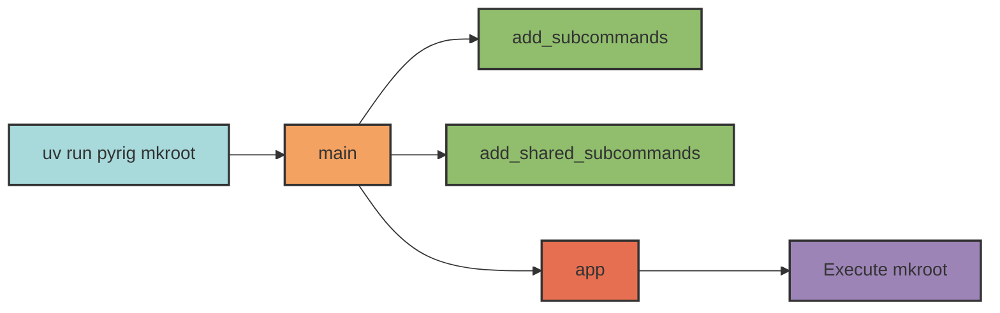
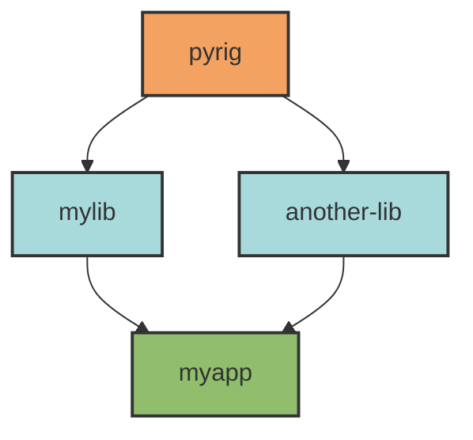

## Overview

Pyrig's CLI system uses **dynamic command discovery** to automatically register commands from Python functions. Simply define a function in your `subcommands.py` module, and it becomes a CLI command - no registration boilerplate required.

<Note>
The CLI system works across your entire dependency chain. Commands from pyrig, intermediate libraries, and your project are all automatically discovered and registered.
</Note>

## How It Works

### Entry Point

Commands are invoked through the console script entry point defined in `pyproject.toml`:

```toml pyproject.toml
[project.scripts]
pyrig = "pyrig.rig.cli.cli:main"
```

Running `uv run pyrig <command>` calls the `main()` function in `pyrig/rig/cli/cli.py`.

### Command Discovery Flow

The `main()` function orchestrates three-phase command discovery:



```python pyrig/rig/cli/cli.py
def main() -> None:
    """Run the pyrig CLI."""
    add_subcommands()              # 1. Project-specific commands
    add_shared_subcommands()        # 2. Shared commands from dependencies
    app()                          # 3. Execute Typer application
```

## Three Types of Commands

### 1. Main Entry Point

Each package can define a `main()` function as its primary entry point:

```python myapp/main.py
def main() -> None:
    """Main entry point for myapp."""
    print("Running myapp!")
```

```bash
$ uv run myapp
Running myapp!
```

The CLI automatically imports and registers `main()` from `<package>.main`.

### 2. Project-Specific Subcommands

Define commands specific to your project in `<package>/rig/cli/subcommands.py`:

```python myapp/rig/cli/subcommands.py
def deploy() -> None:
    """Deploy the application to production."""
    print("Deploying...")

def status() -> None:
    """Check deployment status."""
    print("Status: running")
```

```bash
$ uv run myapp deploy
Deploying...

$ uv run myapp status
Status: running
```

All **public functions** in the module are automatically registered as commands.

### 3. Shared Subcommands

Define commands that work across all packages in `<package>/rig/cli/shared_subcommands.py`:

```python pyrig/rig/cli/shared_subcommands.py
from importlib.metadata import version as _version
import typer
from pyrig.src.cli import project_name_from_argv

def version() -> None:
    """Display the current project's version."""
    project_name = project_name_from_argv()
    typer.echo(f"{project_name} version {_version(project_name)}")
```

```bash
$ uv run pyrig version
pyrig version 3.1.5

$ uv run myapp version
myapp version 1.2.3
```

<Note>
Shared commands adapt to each project's context. The `version` command displays the version of the **current project**, not pyrig's version.
</Note>

## Discovery Mechanism

The CLI uses pyrig's multi-package architecture to discover commands:

### Phase 1: Project-Specific Discovery

```python
def add_subcommands() -> None:
    """Discover and register project-specific commands."""
    # 1. Extract package name from sys.argv[0]
    package_name = package_name_from_argv()

    # 2. Import and register main() entry point
    main_module_name = module_name_replacing_start_module(pyrig_main, package_name)
    main_module = import_module(main_module_name)
    app.command()(main_module.main)

    # 3. Import subcommands module
    subcommands_module_name = module_name_replacing_start_module(
        subcommands, package_name
    )
    subcommands_module = import_module(subcommands_module_name)

    # 4. Register all functions as commands
    sub_cmds = all_functions_from_module(subcommands_module)
    for sub_cmd in sub_cmds:
        app.command()(sub_cmd)
```

**Example:** When running `uv run myapp deploy`:
1. Detects package name: `myapp`
2. Imports `myapp.main` and registers `main()`
3. Imports `myapp.rig.cli.subcommands`
4. Registers all functions (`deploy`, `status`, etc.)

### Phase 2: Shared Command Discovery

```python
def add_shared_subcommands() -> None:
    """Discover and register shared commands across dependency chain."""
    # 1. Extract current package name
    package_name = package_name_from_argv()
    package = import_module(package_name)

    # 2. Find all packages in dependency chain
    all_shared_subcommands_modules = discover_equivalent_modules_across_dependents(
        shared_subcommands,
        pyrig,
        until_package=package,
    )

    # 3. Register functions from each module
    for shared_subcommands_module in all_shared_subcommands_modules:
        sub_cmds = all_functions_from_module(shared_subcommands_module)
        for sub_cmd in sub_cmds:
            app.command()(sub_cmd)
```

**Example:** When running `uv run myapp version`:
1. Finds all packages depending on pyrig: `[pyrig, mylib, myapp]`
2. Imports `shared_subcommands` from each: `pyrig.rig.cli.shared_subcommands`, `mylib.rig.cli.shared_subcommands`, `myapp.rig.cli.shared_subcommands`
3. Registers all functions from all modules

<Warning>
Commands are registered in dependency order. If multiple packages define the same command name, the **last one registered takes precedence**.
</Warning>

## Dependency Graph

The CLI uses `DependencyGraph` to discover packages in your ecosystem:



For `myapp`, the discovery order is:
1. `pyrig` (base dependency)
2. `mylib` (intermediate dependency)
3. `another-lib` (intermediate dependency)
4. `myapp` (current package)

Commands from all four packages are available when running `uv run myapp <command>`.

## Module Name Replacement

The system uses **module name replacement** to find equivalent modules across packages:

```python
# Template module in pyrig
module_name = "pyrig.rig.cli.subcommands"

# Replace "pyrig" with current package name
package_module_name = module_name.replace("pyrig", "myapp", 1)
print(package_module_name)  # "myapp.rig.cli.subcommands"
```

This enables consistent package structure across the ecosystem:

```
pyrig/
  rig/
    cli/
      subcommands.py
      shared_subcommands.py

mylib/
  rig/
    cli/
      subcommands.py
      shared_subcommands.py

myapp/
  rig/
    cli/
      subcommands.py
      shared_subcommands.py
```

## Function Discovery

Functions are extracted from modules using inspection:

```python
def all_functions_from_module(module: ModuleType) -> list[FunctionType]:
    """Extract all functions defined in the module (not imported)."""
    functions = []
    for name in dir(module):
        obj = getattr(module, name)
        if isinstance(obj, FunctionType):
            # Only include functions defined in this module
            if obj.__module__ == module.__name__:
                functions.append(obj)
    return functions
```

<Note>
Only functions **defined directly** in the module are registered. Imported functions are excluded.
</Note>

## Command Definition Best Practices

### Use Type Hints and Docstrings

Typer uses function signatures and docstrings to generate help text:

```python
import typer

def deploy(
    environment: str = typer.Option("production", help="Target environment"),
    force: bool = typer.Option(False, "--force", help="Skip confirmation"),
) -> None:
    """Deploy the application to the specified environment.

    Builds the application and deploys it to the target environment.
    Requires proper credentials to be configured.
    """
    if not force:
        typer.confirm(f"Deploy to {environment}?", abort=True)
    typer.echo(f"Deploying to {environment}...")
```

```bash
$ uv run myapp deploy --help
Usage: myapp deploy [OPTIONS]

  Deploy the application to the specified environment.

  Builds the application and deploys it to the target environment.
  Requires proper credentials to be configured.

Options:
  --environment TEXT  Target environment  [default: production]
  --force            Skip confirmation
  --help             Show this message and exit.
```

### Follow Naming Conventions

- Use **lowercase** function names with underscores: `create_project`, `run_tests`
- The function name becomes the command name with underscores converted to hyphens: `create_project` → `create-project`
- Use **imperative mood** in docstrings: "Deploy the application" not "Deploys the application"

### Import Inside Functions

For commands that import heavy dependencies, import **inside the function**:

```python
def mkroot() -> None:
    """Create or update project configuration files."""
    # Import inside function to avoid slow CLI startup
    from pyrig.rig.cli.commands.create_root import make_project_root
    make_project_root()
```

This keeps CLI startup fast when running commands that don't need these dependencies.

## Global Options

The CLI provides global logging options via a Typer callback:

```python
@app.callback()
def configure_logging(
    verbose: int = typer.Option(
        0, "--verbose", "-v", count=True,
        help="Increase verbosity: -v (DEBUG), -vv (modules), -vvv (timestamps)"
    ),
    quiet: bool = typer.Option(
        False, "--quiet", "-q",
        help="Only show warnings and errors"
    ),
) -> None:
    """Configure logging based on verbosity flags."""
    # Configure logging levels and formats
    ...
```

**Logging levels:**

| Flag | Level | Format |
|------|-------|--------|
| (none) | INFO | Clean (messages only) |
| `-q/--quiet` | WARNING | Warnings and errors only |
| `-v` | DEBUG | With level prefix |
| `-vv` | DEBUG | With module names |
| `-vvv` | DEBUG | With timestamps and full details |

```bash
# Default: INFO level, clean output
$ uv run pyrig mkroot
Creating config file pyproject.toml

# Debug output
$ uv run pyrig -v mkroot
DEBUG: Discovering ConfigFile subclasses
DEBUG: Validating config file PyprojectConfigFile
INFO: Creating config file pyproject.toml

# Quiet mode
$ uv run pyrig -q mkroot
# (no output unless there's an error)
```

<Warning>
Global options must be specified **before** the command name:

```bash
uv run pyrig -v build      # ✓ Correct
uv run pyrig build -v      # ✗ Incorrect - parsed as command argument
```
</Warning>

## Creating Custom Commands

### In Your Project

Create `<package>/rig/cli/subcommands.py`:

```python myapp/rig/cli/subcommands.py
"""Project-specific CLI commands.

All public functions are automatically registered as CLI commands.
"""

import typer

def deploy() -> None:
    """Deploy the application to production."""
    typer.echo("Deploying...")

def rollback(version: str) -> None:
    """Roll back to a previous version."""
    typer.echo(f"Rolling back to {version}...")
```

```bash
$ uv run myapp deploy
Deploying...

$ uv run myapp rollback v1.2.3
Rolling back to v1.2.3...
```

### In A Library

Create `<package>/rig/cli/shared_subcommands.py` for commands that should be available in all dependent projects:

```python mylib/rig/cli/shared_subcommands.py
"""Shared CLI commands available to all dependent projects."""

import typer
from mylib import run_health_check

def health() -> None:
    """Run health checks for all services."""
    result = run_health_check()
    if result.ok:
        typer.echo("✓ All services healthy")
    else:
        typer.echo(f"✗ Health check failed: {result.error}")
        raise typer.Exit(1)
```

Now any project depending on `mylib` automatically has the `health` command:

```bash
$ uv run myapp health
✓ All services healthy
```

## Advantages of This Approach

<Accordion title="No Registration Boilerplate">
Just define a function - it's automatically discovered and registered.

```python
# ✓ pyrig way - just define the function
def deploy() -> None:
    """Deploy the application."""
    ...

# ✗ Traditional way - manual registration
def deploy() -> None:
    """Deploy the application."""
    ...

if __name__ == "__main__":
    parser = argparse.ArgumentParser()
    parser.add_argument('command')
    # ... more boilerplate ...
```
</Accordion>

<Accordion title="Cross-Package Command Discovery">
Commands from all dependencies are automatically available.

```bash
# Commands from pyrig
$ uv run myapp mkroot
$ uv run myapp init

# Commands from mylib
$ uv run myapp health

# Commands from myapp
$ uv run myapp deploy
```
</Accordion>

<Accordion title="Context-Aware Shared Commands">
Shared commands adapt to each project's context.

```bash
# Same command, different context
$ uv run pyrig version
pyrig version 3.1.5

$ uv run myapp version
myapp version 1.2.3
```
</Accordion>

<Accordion title="Consistent Package Structure">
All packages follow the same structure, making them predictable and maintainable.

```
<package>/
  rig/
    cli/
      subcommands.py          # Project-specific commands
      shared_subcommands.py   # Shared commands
```
</Accordion>

## Related Concepts

<CardGroup cols={2}>
  <Card title="Configuration System" icon="sliders" href="/concepts/config-system">
    How pyrig manages configuration files
  </Card>
  <Card title="Multi-Package Inheritance" icon="layer-group" href="/concepts/multi-package-inheritance">
    The `.I` and `.L` pattern for cross-package discovery
  </Card>
  <Card title="CLI Architecture" icon="sitemap" href="/cli/architecture">
    Deep dive into the CLI system design
  </Card>
  <Card title="Subcommands" icon="terminal" href="/cli/subcommands">
    Reference for creating custom commands
  </Card>
</CardGroup>
