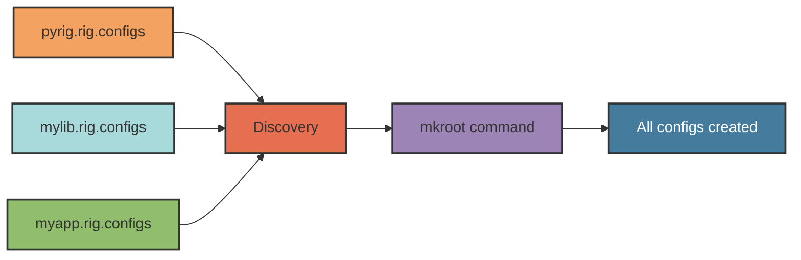
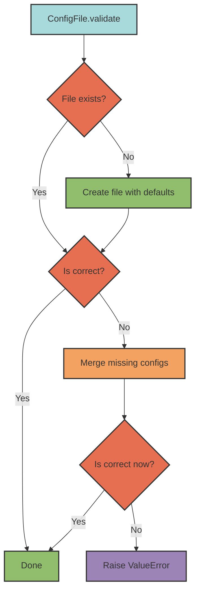

## Overview

The configuration system is the core feature of pyrig that automatically generates and maintains your entire project structure. When you run `pyrig mkroot` or `pyrig init`, pyrig discovers all `ConfigFile` subclasses across your project and its dependencies, then creates or updates every configuration file your project needs.

<Note>
The config system is **declarative** and **idempotent** - you define what configuration should exist, and pyrig ensures it does, preserving your customizations.
</Note>

## How It Works

### ConfigFile Base Class

All configuration files are defined as Python classes inheriting from `ConfigFile`. Each subclass specifies:

- **Where** the file should be located (`parent_path()`)
- **What** content it should contain (`_configs()`)
- **How** to read and write it (`_load()` and `_dump()`)

```python
from pathlib import Path
from pyrig.rig.configs.base.yaml import YamlConfigFile
from pyrig.rig.configs.base.base import ConfigDict

class DatabaseConfigFile(YamlConfigFile):
    """Manages config/database.yaml configuration."""

    def parent_path(self) -> Path:
        """Place in config/ directory."""
        return Path("config")

    def _configs(self) -> ConfigDict:
        """Define required configuration structure."""
        return {
            "database": {
                "host": "localhost",
                "port": 5432,
                "name": "myapp_db"
            }
        }
```

<CodeGroup>
```bash Terminal
$ uv run pyrig mkroot
Creating config file config/database.yaml
```

```yaml config/database.yaml
database:
  host: localhost
  port: 5432
  name: myapp_db
```
</CodeGroup>

### Automatic Discovery

ConfigFile subclasses are automatically discovered across all packages in your dependency chain:



<Warning>
Only **leaf** implementations are used. If you subclass a ConfigFile, only your subclass will be initialized, not the parent. This enables easy customization.
</Warning>

## Validation Process

When a ConfigFile is validated, it follows this workflow:



### Correctness Criteria

A config file is considered correct if:

1. **Empty file** - User opted out (file exists but has 0 bytes)
2. **Superset validation** - Actual config contains all expected keys and values

The validation recursively checks that the expected configuration is a **subset** of the actual configuration.

### Intelligent Merging

When configurations are missing or incorrect, pyrig merges them intelligently:

<Accordion title="Dictionary Merging Rules">
- **Missing keys** are added with expected values
- **Incorrect values** are overwritten with expected values from `_configs()`
- **Extra keys** added by users are preserved
- **Nested dicts** are merged recursively

```python
# Expected config
{"app": {"name": "myapp", "debug": false}}

# User's config
{"app": {"name": "myapp", "debug": true, "custom": "value"}}

# After merge
{"app": {"name": "myapp", "debug": false, "custom": "value"}}
```
</Accordion>

<Accordion title="List Merging Rules">
- **Missing items** are inserted at the correct index
- **Extra items** are preserved
- Order matters - lists are validated by index

```python
# Expected config
["item1", "item2", "item3"]

# User's config
["item1", "item3", "custom"]

# After merge
["item1", "item2", "item3", "custom"]
```
</Accordion>

## Priority-Based Validation

Config files can specify validation priority to handle dependencies:

```python
from pyrig.rig.configs.base.base import Priority

class PyprojectConfigFile(TomlConfigFile):
    def priority(self) -> float:
        """Validate early so other configs can read from it."""
        return Priority.MEDIUM  # 20
```

**Priority values in pyrig:**

| Priority | Value | Config Files | Reason |
|----------|-------|--------------|--------|
| HIGH | 30 | LICENSE | Must exist before pyproject.toml |
| MEDIUM | 20 | pyproject.toml | Many configs read from this |
| LOW | 10 | __init__.py files | Create package structure first |
| DEFAULT | 0 | Most configs | No specific order required |

<Note>
Files within the same priority group are validated **in parallel** using ThreadPoolExecutor for performance. Priority groups are processed sequentially.
</Note>

## Format-Specific Subclasses

Pyrig provides specialized base classes for common file formats:

### YamlConfigFile

```python
from pathlib import Path
from pyrig.rig.configs.base.yaml import YamlConfigFile
from pyrig.rig.configs.base.base import ConfigDict

class MyConfigFile(YamlConfigFile):
    def parent_path(self) -> Path:
        return Path("config")

    def _configs(self) -> ConfigDict:
        return {"key": "value"}
```

Creates `config/my_config.yaml`.

### TomlConfigFile

```python
from pathlib import Path
from pyrig.rig.configs.base.toml import TomlConfigFile
from pyrig.rig.configs.base.base import ConfigDict

class MyConfigFile(TomlConfigFile):
    def parent_path(self) -> Path:
        return Path(".")

    def _configs(self) -> ConfigDict:
        return {"tool": {"myapp": {"setting": "value"}}}
```

Creates `my_config.toml` with formatted output.

### JsonConfigFile

```python
from pathlib import Path
from pyrig.rig.configs.base.json import JsonConfigFile
from pyrig.rig.configs.base.base import ConfigDict

class MyConfigFile(JsonConfigFile):
    def parent_path(self) -> Path:
        return Path("config")

    def _configs(self) -> ConfigDict:
        return {"key": "value"}
```

Creates `config/my_config.json`.

### PythonConfigFile

```python
from pathlib import Path
from pyrig.rig.configs.base.python import PythonConfigFile

class MyConfigFile(PythonConfigFile):
    def parent_path(self) -> Path:
        return Path("myapp/src")

    def lines(self) -> list[str]:
        return [
            '"""Module docstring."""',
            '',
            'def main() -> None:',
            '    """Entry point."""',
            '    pass'
        ]
```

Creates `myapp/src/my_config.py`.

<Accordion title="See all format-specific subclasses">
- **DictConfigFile** - Base for dict-based configs
- **ListConfigFile** - Base for list-based configs (e.g., .gitignore)
- **StringConfigFile** - Plain text files
- **WorkflowConfigFile** - GitHub Actions workflows
- **MarkdownConfigFile** - Markdown files
- **InitConfigFile** - `__init__.py` files with docstrings
- **CopyModuleConfigFile** - Copy entire modules from dependencies
</Accordion>

## Caching System

Both `load()` and `configs()` use `@functools.cache` for performance:

```python
from pyrig.rig.configs.pyproject import PyprojectConfigFile

# First call: reads file and caches result
config1 = PyprojectConfigFile.load()

# Subsequent calls: returns cached data instantly
config2 = PyprojectConfigFile.load()  # No file I/O

assert config1 is config2  # Same object
```

<Warning>
**Never mutate cached results!** Always create new structures:

```python
# ❌ WRONG - corrupts cache
config = MyConfigFile.load()
config["key"] = "new_value"  # Mutates cached object!

# ✓ CORRECT - create new structure
config = MyConfigFile.load()
new_config = {**config, "key": "new_value"}

# ✓ CORRECT - deep copy before modifying
import copy
config = copy.deepcopy(MyConfigFile.load())
config["key"] = "new_value"
```
</Warning>

The cache is invalidated when `dump()` is called.

## Filename Derivation

Filenames are automatically derived from class names:

| Class Name | Filename |
|------------|----------|
| `MyConfigFile` | `my_config` |
| `PyprojectConfigFile` | `pyproject` |
| `DotEnvConfigFile` | `dot_env` |
| `GitignoreConfigFile` | `gitignore` |

The system:
1. Removes abstract parent class suffixes (`ConfigFile`, `YamlConfigFile`, etc.)
2. Converts to snake_case
3. Adds the file extension

Override `filename()` for custom names:

```python
def filename(self) -> str:
    return ""  # Creates ".env" instead of "dot_env.env"
```

## Opt-Out Mechanism

Users can opt out of any config file by **emptying it**:

```bash
# Opt out of a config file
$ echo -n > config/database.yaml

# Validation passes for empty files
$ uv run pyrig mkroot
# No error - empty file is considered "unwanted"
```

<Note>
Deleting a file will cause it to be recreated. Emptying it is the only way to opt out.
</Note>

## Accessing Config Files with `.I`

Use the `.I` class property to access an instance of any ConfigFile:

```python
from pyrig.rig.configs.pyproject import PyprojectConfigFile

# Get file path
path = PyprojectConfigFile.I.path()
print(path)  # Path('pyproject.toml')

# Load configuration
config = PyprojectConfigFile.I.load()
print(config["project"]["name"])  # "myapp"

# Get expected configs
expected = PyprojectConfigFile.I.configs()

# Validate the config file
PyprojectConfigFile.I.validate()
```

See [Multi-Package Inheritance](/concepts/multi-package-inheritance) for details on the `.I` pattern.

## Best Practices

<Accordion title="1. Inherit from format-specific classes">
Use `YamlConfigFile`, `TomlConfigFile`, etc. instead of implementing `_load()` and `_dump()` yourself.

```python
# ✓ Good
class MyConfigFile(YamlConfigFile):
    pass

# ✗ Avoid
class MyConfigFile(ConfigFile):
    def _load(self): ...
    def _dump(self, config): ...
    def extension(self): ...
```
</Accordion>

<Accordion title="2. Keep configs minimal">
Only specify required values. The validation system checks for supersets, so users can add extra configuration.

```python
def _configs(self) -> ConfigDict:
    # Only specify what's required
    return {
        "database": {
            "host": "localhost",  # Required
            "port": 5432,  # Required
        }
        # Users can add: timeout, pool_size, etc.
    }
```
</Accordion>

<Accordion title="3. Use priority for dependencies">
If your config reads from another config file, use priority to ensure correct ordering.

```python
class ReadmeConfigFile(MarkdownConfigFile):
    def priority(self) -> float:
        # Must run after pyproject.toml (priority 20)
        return 0  # Default

    def lines(self) -> list[str]:
        # Safe to read pyproject.toml here
        project = PyprojectConfigFile.I.load()["project"]
        return [f"# {project['name']}", ...]
```
</Accordion>

<Accordion title="4. Document expected structure">
Use docstrings and type hints to document your config structure.

```python
class MyConfigFile(YamlConfigFile):
    """Configuration for database connections.

    Expected structure:
        database:
            host: Database server hostname
            port: Database server port
            name: Database name
    """

    def _configs(self) -> ConfigDict:
        return {"database": {...}}
```
</Accordion>

<Accordion title="5. Never mutate cached results">
Always create new structures instead of modifying results from `load()` or `configs()`.

```python
# ✓ Good
config = MyConfigFile.I.load()
new_config = {**config, "new_key": "value"}

# ✗ Bad
config = MyConfigFile.I.load()
config["new_key"] = "value"  # Corrupts cache!
```
</Accordion>

## Related Concepts

<CardGroup cols={2}>
  <Card title="CLI System" icon="terminal" href="/concepts/cli-system">
    How pyrig discovers and registers CLI commands
  </Card>
  <Card title="Multi-Package Inheritance" icon="layer-group" href="/concepts/multi-package-inheritance">
    The `.I` and `.L` pattern for cross-package discovery
  </Card>
  <Card title="Resources" icon="folder-open" href="/concepts/resources">
    Managing static files in your project
  </Card>
  <Card title="Config Architecture" icon="sitemap" href="/configs/architecture">
    Deep dive into the config system design
  </Card>
</CardGroup>
