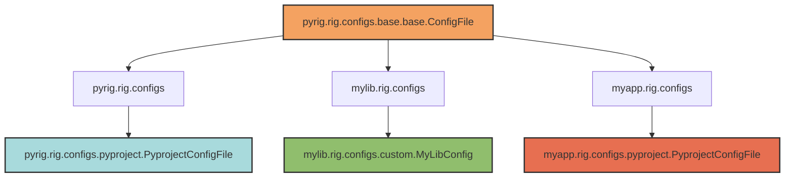

## Overview

Pyrig's multi-package architecture enables **automatic discovery and inheritance** of classes across your entire dependency chain. The `.I` and `.L` class properties provide a convenient way to access leaf implementations without manual imports or registration.

<Note>
The `.I` pattern ("Instance") and `.L` pattern ("Leaf") are core to pyrig's design. They enable configuration inheritance, tool customization, and plugin discovery across packages.
</Note>

## The Problem This Solves

Without multi-package inheritance, customizing behavior requires:

```python
# ❌ Traditional approach: tight coupling
from mylib.config import DatabaseConfig

# Override configuration
class MyDatabaseConfig(DatabaseConfig):
    def get_host(self):
        return "custom-host"

# Manually wire up everywhere
config = MyDatabaseConfig()
connect_to_db(config)  # Must pass custom config everywhere
```

With pyrig's approach:

```python
# ✓ pyrig approach: automatic discovery
from mylib.config import DatabaseConfig

class MyDatabaseConfig(DatabaseConfig):
    def get_host(self):
        return "custom-host"

# Automatic discovery - just use .I
DatabaseConfig.I.get_host()  # Returns "custom-host" from your subclass!
```

## The `.I` Property

`.I` returns an **instance** of the leaf (most-derived) subclass:

```python
from pyrig.rig.configs.pyproject import PyprojectConfigFile

# Get instance of the leaf implementation
instance = PyprojectConfigFile.I

# Access methods on the instance
path = PyprojectConfigFile.I.path()
config = PyprojectConfigFile.I.load()
PyprojectConfigFile.I.validate()
```

### Implementation

```python src/subclass.py
@classproperty
@cache
def I(cls: type[Self]) -> Self:
    """Get an instance of the final leaf subclass."""
    return cls.L()
```

The `.I` property:
1. Calls `.L` to get the leaf class
2. Instantiates it with no arguments
3. Caches the result (singleton per class)

## The `.L` Property

`.L` returns the **leaf class** (most-derived subclass) without instantiating:

```python
from pyrig.rig.configs.pyproject import PyprojectConfigFile

# Get the leaf class
LeafClass = PyprojectConfigFile.L

# Create instances manually
instance1 = LeafClass()
instance2 = LeafClass()
```

### Implementation

```python src/subclass.py
@classproperty
@cache
def L(cls: type[Self]) -> type[Self]:
    """Get the final leaf subclass (deepest in the inheritance tree)."""
    has_leaf, subclasses = generator_has_items(cls.subclasses())

    if not has_leaf:
        msg = f"No concrete subclasses found for {cls.__name__}"
        raise TypeError(msg)

    leaf = next(subclasses)
    second = next(subclasses, None)
    if second is not None:
        msg = (
            f"Multiple concrete subclasses found for {cls.__name__}: "
            f"{', '.join(c.__name__ for c in (leaf, second, *subclasses))}"
        )
        raise TypeError(msg)
    return leaf
```

The `.L` property:
1. Discovers all subclasses across the dependency chain
2. Filters to only concrete (non-abstract) subclasses
3. Discards parent classes (only keeps leaves)
4. Ensures exactly one leaf exists
5. Returns the leaf class
6. Caches the result

<Warning>
If multiple concrete subclasses exist, `.L` raises a `TypeError`. This ensures unambiguous inheritance chains.
</Warning>

## Cross-Package Discovery

The magic happens in `discover_subclasses_across_dependents`:

```python src/modules/package.py
def discover_subclasses_across_dependents(
    cls: type[T],
    dep: ModuleType,
    load_package_before: ModuleType,
) -> Generator[type[T], None, None]:
    """Discover all subclasses of cls across packages depending on dep."""
    # 1. Find all packages depending on dep (e.g., pyrig)
    all_packages = [dep, *all_deps_depending_on_dep(dep)]

    # 2. For each package, import the equivalent module
    for package in all_packages:
        package_module_name = load_package_before.__name__.replace(
            dep.__name__, package.__name__, 1
        )
        package_module = import_module(package_module_name)

        # 3. Discover subclasses in that module
        for subclass in discover_all_subclasses(cls):
            if subclass.__module__.startswith(package_module.__name__):
                yield subclass
```

### Example Discovery Flow



When you call `PyprojectConfigFile.I` from `myapp`:

1. Discovers packages: `[pyrig, mylib, myapp]`
2. Imports: `pyrig.rig.configs`, `mylib.rig.configs`, `myapp.rig.configs`
3. Finds subclasses:
   - `pyrig.rig.configs.pyproject.PyprojectConfigFile`
   - `myapp.rig.configs.pyproject.PyprojectConfigFile`
4. Filters to leaf: `myapp.rig.configs.pyproject.PyprojectConfigFile`
5. Returns instance of your subclass

## Customization Through Subclassing

The `.I` pattern enables easy customization:

### Example: Custom Config File

```python pyrig/rig/configs/pyproject.py
class PyprojectConfigFile(TomlConfigFile):
    """Base pyproject.toml configuration."""

    def _configs(self) -> ConfigDict:
        return {
            "project": {
                "name": PackageManager.I.project_name(),
                "version": "0.1.0",
            }
        }
```

```python myapp/rig/configs/pyproject.py
from pyrig.rig.configs.pyproject import PyprojectConfigFile as Base

class PyprojectConfigFile(Base):
    """Customized pyproject.toml for myapp."""

    def _configs(self) -> ConfigDict:
        base = super()._configs()
        # Add custom configuration
        base["project"]["license"] = "MIT"
        base["tool"]["myapp"] = {"custom": "value"}
        return base
```

Now when pyrig discovers configs:

```python
# From anywhere in the codebase
from pyrig.rig.configs.pyproject import PyprojectConfigFile

# Automatically uses YOUR customized version
config = PyprojectConfigFile.I.load()  # Includes your customizations!
```

### Example: Custom Tool

```python pyrig/rig/tools/linter.py
class Linter(Tool):
    """Base linter tool (uses ruff)."""

    def command(self) -> str:
        return "ruff"

    def check_args(self) -> list[str]:
        return ["check", "."]
```

```python myapp/rig/tools/linter.py
from pyrig.rig.tools.linter import Linter as BaseLinter

class Linter(BaseLinter):
    """Custom linter with project-specific settings."""

    def check_args(self) -> list[str]:
        # Add custom flags
        return ["check", ".", "--exclude", "generated/"]
```

Now throughout the codebase:

```python
from pyrig.rig.tools.linter import Linter

# Automatically uses YOUR customized version
Linter.I.check_args().run()  # Uses your custom flags!
```

## DependencySubclass Base Class

All discoverable classes inherit from `DependencySubclass`:

```python src/subclass.py
class DependencySubclass(ABC):
    """Abstract base providing subclass-discovery contract."""

    @classmethod
    @abstractmethod
    def definition_package(cls) -> ModuleType:
        """Package where subclasses are defined."""

    @classmethod
    @abstractmethod
    def sorting_key(cls, subclass: type[T]) -> Any:
        """Sort key for discovered subclasses."""

    @classmethod
    def base_dependency(cls) -> ModuleType:
        """Base dependency to search from (default: pyrig)."""
        return pyrig

    @classmethod
    def subclasses(cls) -> Generator[type[Self], None, None]:
        """Discover all non-abstract subclasses."""
        return discard_parent_classes(
            discard_abstract_classes(
                discover_subclasses_across_dependents(
                    cls,
                    dep=cls.base_dependency(),
                    load_package_before=cls.definition_package(),
                )
            )
        )

    @classproperty
    @cache
    def L(cls: type[Self]) -> type[Self]:
        """Get the final leaf subclass."""
        ...

    @classproperty
    @cache
    def I(cls: type[Self]) -> Self:
        """Get an instance of the final leaf subclass."""
        return cls.L()
```

### Classes Using DependencySubclass

- **ConfigFile** - Configuration file discovery
- **Tool** - Tool wrapper discovery
- **BuilderConfigFile** - Build artifact discovery

## Practical Examples

### Accessing Config Files

```python
from pyrig.rig.configs.pyproject import PyprojectConfigFile
from pyrig.rig.configs.dot_env import DotEnvConfigFile

# Load configurations
project_config = PyprojectConfigFile.I.load()
env_vars = DotEnvConfigFile.I.load()

# Get file paths
path = PyprojectConfigFile.I.path()  # Path('pyproject.toml')

# Validate configurations
PyprojectConfigFile.I.validate()
```

### Using Tool Wrappers

```python
from pyrig.rig.tools.linter import Linter
from pyrig.rig.tools.version_controller import VersionController
from pyrig.rig.tools.package_manager import PackageManager

# Run tools (uses your customizations if defined)
Linter.I.check_args().run()
VersionController.I.add_all_args().run()
PackageManager.I.install_dependencies_args().run()

# Get tool information
repo_url = VersionController.I.repo_url()
project_name = PackageManager.I.project_name()
```

### Discovering All Subclasses

```python
from pyrig.rig.configs.base.base import ConfigFile

# Discover ALL config files across all packages
for config_class in ConfigFile.subclasses():
    print(f"{config_class.__name__}: {config_class().path()}")

# Output:
# PyprojectConfigFile: pyproject.toml
# GitignoreConfigFile: .gitignore
# DotEnvConfigFile: .env
# MyCustomConfigFile: config/custom.yaml
# ...
```

### Validating All Configs

```python
from pyrig.rig.configs.base.base import ConfigFile

# Validate all discovered config files
ConfigFile.validate_all_subclasses()

# This is what `pyrig mkroot` does!
```

## When to Use `.I` vs `.L`

### Use `.I` When:

- **Calling methods** on the leaf instance
- **Accessing properties** that require instantiation
- **Common case** - most usage

```python
# ✓ Use .I for method calls
config = PyprojectConfigFile.I.load()
path = PyprojectConfigFile.I.path()
Linter.I.check_args().run()
```

### Use `.L` When:

- **Creating multiple instances** manually
- **Passing the class** (not instance) to other functions
- **Type checking** or introspection

```python
# ✓ Use .L for manual instantiation
LeafClass = PyprojectConfigFile.L
instance1 = LeafClass()
instance2 = LeafClass()

# ✓ Use .L for type checking
if isinstance(obj, PyprojectConfigFile.L):
    ...
```

## Benefits of This Pattern

<Accordion title="1. Zero-Configuration Plugin System">
No registration required. Just subclass and it's automatically discovered.

```python
# Just define the subclass
class MyPluginConfigFile(YamlConfigFile):
    ...

# Automatically discovered and used
ConfigFile.validate_all_subclasses()  # Includes your plugin!
```
</Accordion>

<Accordion title="2. Dependency Injection Without Boilerplate">
The `.I` pattern provides automatic dependency injection.

```python
# No need to wire up dependencies
class MyConfigFile(YamlConfigFile):
    def _configs(self) -> ConfigDict:
        # Just use .I - automatically gets the right implementation
        project = PyprojectConfigFile.I.load()["project"]
        return {"project_name": project["name"]}
```
</Accordion>

<Accordion title="3. Easy Customization">
Override any class by subclassing with the same name.

```python
# In your project
class PyprojectConfigFile(Base):
    def _configs(self):
        # Add your customizations
        ...

# Automatically used everywhere
PyprojectConfigFile.I.load()  # Your version!
```
</Accordion>

<Accordion title="4. Type-Safe">
Fully type-hinted with generics for safety.

```python
class ConfigFile[ConfigT: ConfigData](DependencySubclass):
    @classproperty
    def I(cls: type[Self]) -> Self: ...

    @classproperty
    def L(cls: type[Self]) -> type[Self]: ...
```
</Accordion>

## Common Patterns

### Pattern 1: Override Defaults

```python
# Import base with alias
from pyrig.rig.configs.pyproject import PyprojectConfigFile as Base

# Keep same name for automatic discovery
class PyprojectConfigFile(Base):
    def _configs(self) -> ConfigDict:
        config = super()._configs()
        # Customize
        config["project"]["license"] = "Apache-2.0"
        return config
```

### Pattern 2: Add New Config Files

```python
from pathlib import Path
from pyrig.rig.configs.base.yaml import YamlConfigFile

class DatabaseConfigFile(YamlConfigFile):
    """Add new config file to your project."""

    def parent_path(self) -> Path:
        return Path("config")

    def _configs(self) -> ConfigDict:
        return {"database": {"host": "localhost"}}
```

### Pattern 3: Customize Tool Behavior

```python
from pyrig.rig.tools.linter import Linter as BaseLinter

class Linter(BaseLinter):
    """Customize linter for your project."""

    def check_args(self) -> list[str]:
        return ["check", ".", "--config", "custom-config.toml"]
```

## Limitations and Considerations

<Warning>
**Single Leaf Requirement**: Each base class can have only one concrete leaf subclass. Multiple concrete subclasses raise a `TypeError`.

```python
# ✗ This will raise TypeError
class CustomConfig1(BaseConfig): ...
class CustomConfig2(BaseConfig): ...  # Error: multiple leaves!

# ✓ Only one leaf per base
class CustomConfig(BaseConfig): ...
```
</Warning>

<Note>
**Naming Convention**: Keep the same class name when subclassing for automatic discovery. Use import aliases to avoid conflicts:

```python
from pyrig.rig.configs.pyproject import PyprojectConfigFile as Base

class PyprojectConfigFile(Base):  # Same name = automatic discovery
    ...
```
</Note>

## Related Concepts

<CardGroup cols={2}>
  <Card title="Configuration System" icon="sliders" href="/concepts/config-system">
    How config files use .I for automatic discovery
  </Card>
  <Card title="CLI System" icon="terminal" href="/concepts/cli-system">
    How CLI commands are discovered across packages
  </Card>
  <Card title="Tool Wrappers" icon="wrench" href="/tools/index">
    How tools use .I for customization
  </Card>
  <Card title="Config Architecture" icon="sitemap" href="/configs/architecture">
    Deep dive into config file discovery
  </Card>
</CardGroup>
