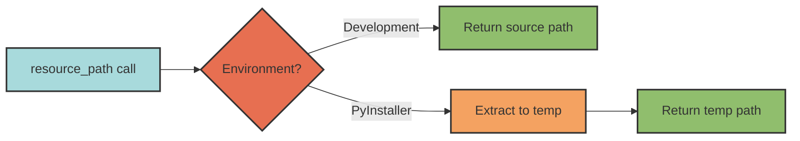

## Overview

The resources system provides **unified access to static files** (templates, icons, configs, etc.) that work identically in development and PyInstaller-bundled executables. Using `importlib.resources`, it abstracts away environment-specific path resolution.

<Note>
Resources are static files bundled with your Python package. They're accessible whether your code is running from source files or a PyInstaller executable.
</Note>

## Why Resources?

When distributing Python applications as executables, traditional file access breaks:

```python
# ❌ Breaks in PyInstaller executables
with open("templates/config.json") as f:
    config = json.load(f)

# ❌ Also breaks - relies on __file__ which may not exist
module_dir = Path(__file__).parent
template_path = module_dir / "templates" / "email.html"
```

With resources:

```python
# ✓ Works in development AND executables
from pyrig.src.resource import resource_path
import myapp.templates

template_path = resource_path("email.html", myapp.templates)
with open(template_path) as f:
    template = f.read()
```

## The `resource_path` Function

Pyrig provides a single function for resource access:

```python src/resource.py
def resource_path(name: str, package: ModuleType) -> Path:
    """Get filesystem path to a resource file within a package.

    Provides cross-platform, environment-agnostic access to static resources
    bundled with Python packages.

    Args:
        name: Resource filename (e.g., "config.json", "icon.png").
            Can include subdirectory paths relative to the package
            (e.g., "templates/email.html").
        package: Package module object containing the resource.
            Import the package's __init__.py module and pass it directly.

    Returns:
        Absolute path to the resource file.

    Example:
        >>> from pyrig import resources
        >>> path = resource_path("GITIGNORE", resources)
        >>> content = path.read_text()
    """
    resource_path = files(package) / name
    with as_file(resource_path) as path:
        return path
```

### Implementation Details

Under the hood, `resource_path` uses `importlib.resources`:

```python
from importlib.resources import as_file, files

resource_path = files(package) / name
with as_file(resource_path) as path:
    return path
```

- **`files(package)`** - Returns a traversable resource in the package
- **`as_file()`** - Ensures the resource is accessible as a filesystem path
- **Development** - Returns the actual file path
- **PyInstaller** - Extracts to a temporary directory and returns that path

## How to Use Resources

### Step 1: Organize Resources

Create a package to hold your resources:

```
myapp/
  resources/
    __init__.py          # Empty or with docstring
    icon.png
    config.json
    templates/
      __init__.py
      email.html
      report.md
```

### Step 2: Import the Package

```python
import myapp.resources
import myapp.resources.templates
```

### Step 3: Access Resources

```python
from pyrig.src.resource import resource_path
import myapp.resources
import myapp.resources.templates

# Get resource paths
icon_path = resource_path("icon.png", myapp.resources)
config_path = resource_path("config.json", myapp.resources)
template_path = resource_path("email.html", myapp.resources.templates)

# Use the paths
with open(config_path) as f:
    config = json.load(f)

with open(template_path) as f:
    template = f.read()

image = Image.open(icon_path)
```

<Note>
The returned path is valid **immediately** and remains valid after the function returns (for file-based packages, which is always the case for pyrig projects).
</Note>

## Pyrig's Built-in Resources

Pyrig includes resource files used during project initialization:

```python
from pyrig.src.resource import resource_path
from pyrig import resources

# Pyrig's resources
gitignore_template = resource_path("GITIGNORE", resources)
license_template = resource_path("LICENSE.md", resources)

# Read the content
content = gitignore_template.read_text()
```

### Example: GitignoreConfigFile

Pyrig uses resources to populate config files:

```python rig/configs/git/gitignore.py
from pyrig import resources
from pyrig.src.resource import resource_path
from pyrig.rig.configs.base.string_ import StringConfigFile

class GitignoreConfigFile(StringConfigFile):
    """Manages .gitignore file."""

    def parent_path(self) -> Path:
        return Path(".")

    def filename(self) -> str:
        return ".gitignore"

    def extension(self) -> str:
        return ""  # No extension

    def lines(self) -> list[str]:
        # Load from bundled resource
        resource = resource_path("GITIGNORE", resources)
        return resource.read_text().splitlines()
```

This works whether pyrig is installed from source or as a bundled executable.

## PyInstaller Integration

### Data Files Configuration

When building with PyInstaller, specify data files in your spec file:

```python myapp.spec
a = Analysis(
    ['myapp/main.py'],
    datas=[
        ('myapp/resources', 'myapp/resources'),  # Include resources directory
    ],
    ...
)
```

Or use `--add-data` flag:

```bash
pyinstaller myapp/main.py \
    --add-data "myapp/resources:myapp/resources"
```

### How It Works

1. **Development**: `resource_path` returns the actual file path in your source tree
2. **PyInstaller Build**: Resources are packaged into the executable
3. **PyInstaller Runtime**: Resources are extracted to a temporary directory, and `resource_path` returns the temp path



<Warning>
The temporary directory is cleaned up when the application exits. If you need persistent files, copy them to a permanent location.
</Warning>

## Common Patterns

### Pattern 1: Configuration Templates

```python
from pyrig.src.resource import resource_path
import myapp.resources
import json

def load_default_config() -> dict:
    """Load default configuration from resource."""
    config_path = resource_path("default_config.json", myapp.resources)
    with open(config_path) as f:
        return json.load(f)
```

### Pattern 2: Email Templates

```python
from pyrig.src.resource import resource_path
import myapp.resources.templates
from string import Template

def render_email(name: str, message: str) -> str:
    """Render email from template."""
    template_path = resource_path("email.html", myapp.resources.templates)
    template_content = template_path.read_text()

    template = Template(template_content)
    return template.substitute(name=name, message=message)
```

### Pattern 3: Icon/Image Assets

```python
from pyrig.src.resource import resource_path
import myapp.resources.images
from PIL import Image

def load_app_icon() -> Image:
    """Load application icon."""
    icon_path = resource_path("icon.png", myapp.resources.images)
    return Image.open(icon_path)
```

### Pattern 4: Data Files

```python
from pyrig.src.resource import resource_path
import myapp.resources.data
import csv

def load_lookup_table() -> list[dict]:
    """Load lookup table from CSV resource."""
    csv_path = resource_path("lookup.csv", myapp.resources.data)
    with open(csv_path) as f:
        return list(csv.DictReader(f))
```

## Best Practices

<Accordion title="1. Organize Resources by Type">
Create subdirectories for different resource types:

```
myapp/
  resources/
    __init__.py
    images/
      __init__.py
      icon.png
      logo.svg
    templates/
      __init__.py
      email.html
      report.md
    data/
      __init__.py
      config.json
      lookup.csv
```
</Accordion>

<Accordion title="2. Always Pass Package Modules">
Pass the **imported module object**, not strings:

```python
# ✓ Correct
import myapp.resources
path = resource_path("icon.png", myapp.resources)

# ✗ Wrong
path = resource_path("icon.png", "myapp.resources")  # TypeError!
```
</Accordion>

<Accordion title="3. Use Relative Paths Within Packages">
Keep resource paths relative to the package:

```python
# ✓ Good - relative to package
path = resource_path("templates/email.html", myapp.resources)

# ✗ Avoid - use subpackages instead
path = resource_path("../other_package/file.txt", myapp.resources)
```
</Accordion>

<Accordion title="4. Cache Large Resources">
If you access the same resource repeatedly, cache it:

```python
from functools import cache
from pyrig.src.resource import resource_path
import myapp.resources

@cache
def get_large_lookup_table() -> dict:
    """Load and cache large resource."""
    path = resource_path("large_data.json", myapp.resources)
    with open(path) as f:
        return json.load(f)
```
</Accordion>

<Accordion title="5. Include __init__.py Files">
Ensure every resource directory is a Python package:

```
myapp/
  resources/
    __init__.py          # Required!
    templates/
      __init__.py        # Required!
      email.html
```

Without `__init__.py`, the directory won't be treated as a package.
</Accordion>

## Troubleshooting

### FileNotFoundError

```python
# Error: FileNotFoundError: resource not found
path = resource_path("missing.json", myapp.resources)
```

**Solutions:**
- Verify the file exists in the package directory
- Check the spelling of the filename
- Ensure the package has an `__init__.py` file
- For PyInstaller, verify data files are included in the spec

### TypeError: package is not a module

```python
# Error: TypeError
path = resource_path("icon.png", "myapp.resources")  # String!
```

**Solution:** Pass the imported module object:

```python
import myapp.resources
path = resource_path("icon.png", myapp.resources)  # Module object
```

### Resources Not Found in PyInstaller Executable

**Check your spec file includes data files:**

```python
a = Analysis(
    ['myapp/main.py'],
    datas=[
        ('myapp/resources', 'myapp/resources'),  # Add this
    ],
)
```

**Or use --add-data flag:**

```bash
pyinstaller myapp/main.py --add-data "myapp/resources:myapp/resources"
```

## Comparison with Alternatives

### vs `__file__` Attribute

```python
# ❌ Breaks in PyInstaller (no __file__ in frozen executables)
module_dir = Path(__file__).parent
config_path = module_dir / "config.json"

# ✓ Works everywhere
from pyrig.src.resource import resource_path
import myapp.resources
config_path = resource_path("config.json", myapp.resources)
```

### vs Hardcoded Paths

```python
# ❌ Breaks when installed or moved
config_path = Path("/home/user/myapp/config.json")

# ✓ Works regardless of installation location
config_path = resource_path("config.json", myapp.resources)
```

### vs pkg_resources (deprecated)

```python
# ❌ Deprecated (setuptools)
import pkg_resources
path = pkg_resources.resource_filename("myapp.resources", "icon.png")

# ✓ Modern (importlib.resources)
from pyrig.src.resource import resource_path
import myapp.resources
path = resource_path("icon.png", myapp.resources)
```

## Complete Example

Here's a complete example of using resources in a project:

```python myapp/resources/__init__.py
"""Static resources for myapp."""
```

```json myapp/resources/config.json
{
  "database": {
    "host": "localhost",
    "port": 5432
  }
}
```

```python myapp/src/config.py
from pathlib import Path
import json
from pyrig.src.resource import resource_path
import myapp.resources

def load_default_config() -> dict:
    """Load default configuration from resources."""
    config_path = resource_path("config.json", myapp.resources)
    with open(config_path) as f:
        return json.load(f)

def load_user_config() -> dict:
    """Load user configuration, falling back to default."""
    user_config_path = Path.home() / ".myapp" / "config.json"

    if user_config_path.exists():
        with open(user_config_path) as f:
            return json.load(f)

    # Fall back to default from resources
    return load_default_config()
```

```python myapp/main.py
from myapp.src.config import load_user_config

def main() -> None:
    config = load_user_config()
    print(f"Database: {config['database']['host']}:{config['database']['port']}")

if __name__ == "__main__":
    main()
```

## Related Concepts

<CardGroup cols={2}>
  <Card title="Configuration System" icon="sliders" href="/concepts/config-system">
    How config files use resources for templates
  </Card>
  <Card title="Builders" icon="box" href="/builders/index">
    How PyInstaller builders package resources
  </Card>
  <Card title="Resources Documentation" icon="folder-open" href="/resources/index">
    Full documentation on resource management
  </Card>
  <Card title="PyInstaller Builder" icon="cube" href="/builders/pyinstaller">
    Creating executables with bundled resources
  </Card>
</CardGroup>
