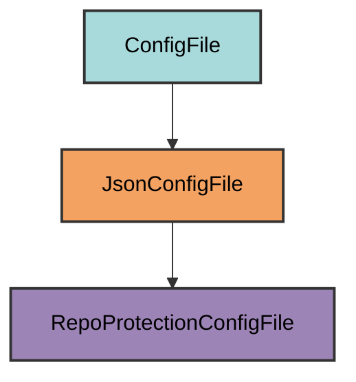

# branch-protection.json

Branch protection ruleset configuration for GitHub repository protection.

## Overview

The branch protection configuration file defines the ruleset that protects your repository's main branch. This file is automatically generated by pyrig and used by the `protect-repo` command to create or update GitHub branch protection rules.

The `protect-repo` command loads this file and applies it to GitHub via the API. It passes the JSON as a dict to the API, so any adjustments must align with GitHub's REST API schema. To customize, manually configure settings in GitHub, export the ruleset, and use that structure when subclassing `RepoProtectionConfigFile`.

## Inheritance



**Inherits from**: `JsonConfigFile`

**What this means**:

- Uses JSON format for configuration
- Loads/dumps with Python's `json` module
- Validation ensures expected configuration is present in the actual file
- File can be manually uploaded to GitHub
- Configuration is passed directly to GitHub's REST API

## File Location

**Path**: `branch-protection.json` (project root)

**Extension**: `.json` - JSON configuration file.

## Purpose

This configuration file serves as a declarative definition of your repository's branch protection rules. Instead of hardcoding protection settings in Python, pyrig generates a JSON file that:

- Matches GitHub's ruleset export/import format
- Can be manually uploaded to GitHub if needed
- Provides transparency into protection rules

## Configuration Structure

The file contains a complete GitHub ruleset definition:

```json
{
  "name": "main-protection",
  "target": "branch",
  "enforcement": "active",
  "conditions": {
    "ref_name": {
      "exclude": [],
      "include": ["~DEFAULT_BRANCH"]
    }
  },
  "rules": [
    { "type": "creation" },
    { "type": "update" },
    { "type": "deletion" },
    { "type": "required_linear_history" },
    { "type": "required_signatures" },
    {
      "type": "pull_request",
      "parameters": {
        "required_approving_review_count": 1,
        "dismiss_stale_reviews_on_push": true,
        "required_reviewers": [],
        "require_code_owner_review": true,
        "require_last_push_approval": true,
        "required_review_thread_resolution": true,
        "allowed_merge_methods": ["squash", "rebase"]
      }
    },
    {
      "type": "required_status_checks",
      "parameters": {
        "strict_required_status_checks_policy": true,
        "do_not_enforce_on_create": true,
        "required_status_checks": [{ "context": "health_check" }]
      }
    },
    { "type": "non_fast_forward" }
  ],
  "bypass_actors": [
    {
      "actor_id": 5,
      "actor_type": "RepositoryRole",
      "bypass_mode": "always"
    }
  ]
}
```

## Key Configuration Elements

### Ruleset Name

<ParamField path="name" type="string" default="main-protection">
  Identifies the ruleset in GitHub. This is the name that appears in Settings → Rules → Rulesets.
</ParamField>

### Target

<ParamField path="target" type="string" default="branch">
  Applies rules to branches (alternatives: `"tag"` for tags, `"push"` for push events).
</ParamField>

### Enforcement

<ParamField path="enforcement" type="string" default="active">
  Rules are enforced. Alternatives:
  - `"disabled"`: Rules not enforced
  - `"evaluate"`: Dry-run mode (logs violations without blocking)
</ParamField>

### Conditions

<ParamField path="conditions.ref_name.include" type="list[string]" default='["~DEFAULT_BRANCH"]'>
  Applies to the default branch (usually `main` or `master`). Use `~DEFAULT_BRANCH` to automatically target the repository's default branch.
</ParamField>

<ParamField path="conditions.ref_name.exclude" type="list[string]" default="[]">
  Branches to exclude from the ruleset. Empty by default.
</ParamField>

### Rules

#### Creation/Update/Deletion Protection

```json
{ "type": "creation" },
{ "type": "update" },
{ "type": "deletion" }
```

Prevents unauthorized branch operations:
- **creation**: Blocks creating branches matching the pattern
- **update**: Blocks direct pushes to the branch
- **deletion**: Prevents branch deletion

#### Required Linear History

```json
{ "type": "required_linear_history" }
```

Enforces linear commit history (no merge commits). Only squash and rebase merges are allowed.

#### Required Signatures

```json
{ "type": "required_signatures" }
```

Requires all commits to be signed with GPG/SSH keys for security.

#### Pull Request Requirements

```json
{
  "type": "pull_request",
  "parameters": {
    "required_approving_review_count": 1,
    "dismiss_stale_reviews_on_push": true,
    "required_reviewers": [],
    "require_code_owner_review": true,
    "require_last_push_approval": true,
    "required_review_thread_resolution": true,
    "allowed_merge_methods": ["squash", "rebase"]
  }
}
```

<ParamField path="required_approving_review_count" type="integer" default="1">
  Minimum number of approving reviews required to merge.
</ParamField>

<ParamField path="dismiss_stale_reviews_on_push" type="boolean" default="true">
  Dismisses existing approvals when new commits are pushed.
</ParamField>

<ParamField path="require_code_owner_review" type="boolean" default="true">
  Requires approval from code owners (defined in CODEOWNERS file).
</ParamField>

<ParamField path="require_last_push_approval" type="boolean" default="true">
  Requires that the last push be approved (prevents self-merge).
</ParamField>

<ParamField path="required_review_thread_resolution" type="boolean" default="true">
  All review comment threads must be resolved before merging.
</ParamField>

<ParamField path="allowed_merge_methods" type="list[string]" default='["squash", "rebase"]'>
  Only squash and rebase merges allowed (no merge commits).
</ParamField>

#### Required Status Checks

```json
{
  "type": "required_status_checks",
  "parameters": {
    "strict_required_status_checks_policy": true,
    "do_not_enforce_on_create": true,
    "required_status_checks": [{ "context": "health_check" }]
  }
}
```

<ParamField path="strict_required_status_checks_policy" type="boolean" default="true">
  Branch must be up to date with base branch before merging.
</ParamField>

<ParamField path="do_not_enforce_on_create" type="boolean" default="true">
  Status checks not required when creating the branch (only on merge).
</ParamField>

<ParamField path="required_status_checks" type="list[dict]">
  List of required status checks. Pyrig requires the `health_check` job from the health check workflow to pass.
</ParamField>

#### Non-Fast-Forward Protection

```json
{ "type": "non_fast_forward" }
```

Prevents force pushes and branch history rewrites.

### Bypass Actors

```json
{
  "actor_id": 5,
  "actor_type": "RepositoryRole",
  "bypass_mode": "always"
}
```

<ParamField path="actor_id" type="integer" default="5">
  GitHub's standard ID for repository admins.
</ParamField>

<ParamField path="actor_type" type="string" default="RepositoryRole">
  Type of actor (alternatives: `"User"`, `"Team"`, `"OrganizationAdmin"`).
</ParamField>

<ParamField path="bypass_mode" type="string" default="always">
  Repository admins can always bypass all rules.
</ParamField>

## How It Works

### Automatic Generation

When initialized via `uv run pyrig mkroot`, the `branch-protection.json` file is created by:

1. **Generating ruleset configuration**: `RepoProtectionConfigFile.I.configs()` creates the complete ruleset
2. **Setting required status checks**: Uses health check workflow job IDs
3. **Configuring bypass actors**: Adds repository admin bypass permissions
4. **Applying security defaults**: Enforces pyrig's opinionated protection rules

The class programmatically generates the configuration using:

- Health check workflow job IDs for required status checks
- Standard GitHub actor IDs for bypass permissions (actor_id: 5 = Repository admins)
- Pyrig's opinionated security defaults

### Application to GitHub

The `protect-repo` command loads this file and applies it to GitHub:

```bash
uv run pyrig protect-repo
```

This command:

1. Loads `branch-protection.json` using `RepoProtectionConfigFile.I.load()`
2. Checks if a ruleset with the same name exists
3. Creates or updates the ruleset via GitHub API
4. Applies all protection rules to the main branch

The configuration is passed directly to GitHub's REST API as a dictionary, so any manual modifications must align with GitHub's ruleset schema.

## Usage

### Automatic Creation

The file is automatically created when you initialize your project:

```bash
uv run pyrig mkroot
```

This generates `branch-protection.json` with pyrig's default protection rules.

### Applying to GitHub

The protection rules are automatically applied by the health check workflow. To manually apply:

```bash
uv run pyrig protect-repo
```

This requires the `REPO_TOKEN` secret to be configured in your repository.

### Manual Upload to GitHub

You can also manually upload this file to GitHub:

1. Go to repository Settings → Rules → Rulesets
2. Click "New ruleset" → "Import a ruleset"
3. Upload `branch-protection.json`
4. Review and create

You probably will not need this because the CI/CD pipeline will handle it for you via the `protect-repo` command.

### Customization

To customize branch protection rules, subclass `RepoProtectionConfigFile`:

```python
from pyrig.rig.configs.base.base import ConfigDict
from pyrig.rig.configs.git.branch_protection import RepoProtectionConfigFile

class MyRepoProtectionConfigFile(RepoProtectionConfigFile):
    def _configs(self) -> ConfigDict:
        """Custom branch protection configuration."""
        config = super()._configs()
        # Require 2 approvals instead of 1
        for rule in config["rules"]:
            if rule.get("type") == "pull_request":
                rule["parameters"]["required_approving_review_count"] = 2
        return config
```

Place in `myapp/rig/configs/git/branch_protection.py` and it will override the default configuration.

### Verifying Configuration

After applying, verify the ruleset in GitHub after the CI/CD pipeline runs and activated it with the command `uv run pyrig protect-repo`:

1. Go to repository Settings → Rules → Rulesets
2. Find the `main-protection` ruleset
3. Review the applied rules

Or export the current ruleset from GitHub and compare with your local file.

## Best Practices

1. **Don't modify the file directly**: Use subclassing to customize rules instead of editing the generated file
2. **Align with GitHub's schema**: If you manually edit the JSON, ensure it matches GitHub's ruleset API schema
3. **Export from GitHub for reference**: Manually configure rules in GitHub UI, export the ruleset, and use that structure for customization
4. **Test in a separate repository**: Test custom protection rules in a test repository before applying to production
5. **Keep bypass actors minimal**: Only allow repository admins to bypass rules
6. **Use the CI/CD pipeline**: Let the health check workflow apply protection automatically instead of manual uploads

## Related

- [GitHub Workflows](github-workflows)
- [Configuration Overview](overview)
- [GitHub Rulesets API](https://docs.github.com/en/rest/repos/rules)
