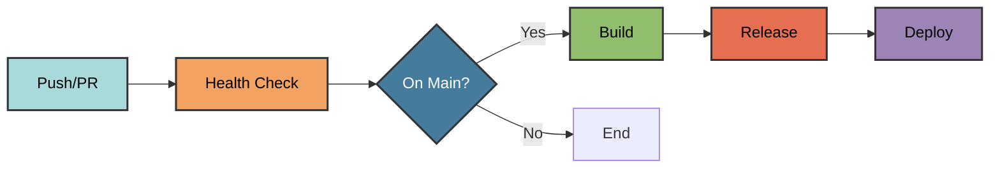

# GitHub Actions Workflows

Pyrig automatically generates GitHub Actions workflows for CI/CD automation. All workflows are created in `.github/workflows/` and use the `WorkflowConfigFile` base class.

## Overview

Pyrig provides four main workflows:

1. **Health Check** (`health_check.yml`) - Continuous integration testing
2. **Build** (`build.yml`) - Build artifacts and container images
3. **Release** (`release.yml`) - Create GitHub releases with changelog
4. **Deploy** (`deploy.yml`) - Deploy documentation to GitHub Pages

## Workflow Architecture



## Health Check Workflow

**File**: `.github/workflows/health_check.yml`

**Purpose**: Runs comprehensive code quality checks and tests.

**Triggers**:
- Pull requests to any branch
- Pushes to main branch
- Scheduled daily runs (staggered by dependency depth)

**Jobs**:

1. **health_checks** - Runs on Ubuntu only:
   - Pre-commit hooks (ruff, ty, bandit, rumdl)
   - Dependency audit (pip-audit)
   - Repository protection (protect-repo command)

2. **matrix_health_checks** - Runs across OS and Python versions:
   - pytest with coverage reporting
   - Coverage upload to Codecov

3. **health_check** - Aggregates results from above jobs

**Matrix Strategy**:

```yaml
strategy:
  matrix:
    os: [ubuntu-latest, windows-latest, macos-latest]
    python-version: ["3.12", "3.13"]  # From pyproject.toml
```

**Example Configuration**:

```yaml
name: Health Check Workflow
on:
  pull_request:
    types: [opened, synchronize, reopened]
  push:
    branches: [main]
  schedule:
    - cron: "0 2 * * *"  # Staggered based on dependency depth

jobs:
  health_checks:
    runs-on: ubuntu-latest
    steps:
      - uses: actions/checkout@main
      - uses: astral-sh/setup-uv@main
        with:
          python-version: "3.13"
      - run: uv sync
      - run: uv run prek run --all-files
      - run: uv run pip-audit
      - run: uv run pyrig protect-repo
        env:
          REPO_TOKEN: ${{ secrets.REPO_TOKEN }}

  matrix_health_checks:
    strategy:
      matrix:
        os: [ubuntu-latest, windows-latest, macos-latest]
        python-version: ["3.12", "3.13"]
    runs-on: ${{ matrix.os }}
    steps:
      - uses: actions/checkout@main
      - uses: astral-sh/setup-uv@main
        with:
          python-version: ${{ matrix.python-version }}
      - run: uv sync
      - run: uv run pytest --cov=myapp --cov-report=xml
      - uses: codecov/codecov-action@main
        with:
          files: coverage.xml
          token: ${{ secrets.CODECOV_TOKEN }}

  health_check:
    needs: [health_checks, matrix_health_checks]
    runs-on: ubuntu-latest
    steps:
      - run: echo "All health checks passed"
```

For full details, see [Health Check Workflow Documentation](workflows/health_check).

## Build Workflow

**File**: `.github/workflows/build.yml`

**Purpose**: Builds artifacts and container images after health checks pass.

**Triggers**:
- Health check workflow completion on main branch (excludes cron)

**Jobs**:

1. **build_artifacts** - Builds Python wheels:
   - Runs across OS matrix
   - Patches version (increments patch number)
   - Builds with uv
   - Uploads artifacts

2. **build_container_image** - Builds container image:
   - Installs podman
   - Builds container image from Containerfile
   - Saves image as tar archive
   - Uploads as artifact

**Example Configuration**:

```yaml
name: Build Workflow
on:
  workflow_run:
    workflows: ["Health Check Workflow"]
    branches: [main]
    types: [completed]

jobs:
  build_artifacts:
    if: |
      github.event.workflow_run.conclusion == 'success' &&
      github.event.workflow_run.event != 'schedule'
    strategy:
      matrix:
        os: [ubuntu-latest, windows-latest, macos-latest]
    runs-on: ${{ matrix.os }}
    steps:
      - uses: actions/checkout@main
      - uses: astral-sh/setup-uv@main
      - run: uv run pyrig build
      - uses: actions/upload-artifact@main
        with:
          name: package-${{ matrix.os }}
          path: dist

  build_container_image:
    if: |
      github.event.workflow_run.conclusion == 'success' &&
      github.event.workflow_run.event != 'schedule'
    runs-on: ubuntu-latest
    steps:
      - uses: actions/checkout@main
      - uses: redhat-actions/podman-install@main
      - run: podman build -t myapp:latest .
      - run: podman save -o dist/myapp.tar myapp:latest
      - uses: actions/upload-artifact@main
        with:
          name: container-image
          path: dist
```

For full details, see [Build Workflow Documentation](workflows/build).

## Release Workflow

**File**: `.github/workflows/release.yml`

**Purpose**: Creates GitHub releases with changelog and artifacts.

**Triggers**:
- Build workflow completion on main branch

**Jobs**:

1. **release** - Creates release:
   - Downloads all artifacts from build workflow
   - Extracts version from pyproject.toml
   - Builds changelog from commits
   - Creates git tag
   - Pushes tag and commits
   - Creates GitHub release with artifacts
   - Publishes to PyPI (if PYPI_TOKEN is set)

**Example Configuration**:

```yaml
name: Release Workflow
on:
  workflow_run:
    workflows: ["Build Workflow"]
    branches: [main]
    types: [completed]

jobs:
  release:
    if: github.event.workflow_run.conclusion == 'success'
    runs-on: ubuntu-latest
    steps:
      - uses: actions/checkout@main
        with:
          token: ${{ secrets.REPO_TOKEN }}
      - uses: astral-sh/setup-uv@main
      - run: uv sync
      - uses: actions/download-artifact@main
        with:
          path: dist
          merge-multiple: true
      - id: extract_version
        run: echo "version=v$(uv run pyrig version --short)" >> $GITHUB_OUTPUT
      - uses: mikepenz/release-changelog-builder-action@develop
        id: build_changelog
        with:
          token: ${{ secrets.GITHUB_TOKEN }}
      - run: git tag ${{ steps.extract_version.outputs.version }}
      - run: git push origin ${{ steps.extract_version.outputs.version }}
      - uses: ncipollo/release-action@main
        with:
          tag: ${{ steps.extract_version.outputs.version }}
          name: myapp ${{ steps.extract_version.outputs.version }}
          body: ${{ steps.build_changelog.outputs.changelog }}
          artifacts: dist/*
      - run: |
          if [ -n "${{ secrets.PYPI_TOKEN }}" ]; then
            uv publish --token ${{ secrets.PYPI_TOKEN }}
          fi
```

For full details, see [Release Workflow Documentation](workflows/release).

## Deploy Workflow

**File**: `.github/workflows/deploy.yml`

**Purpose**: Deploys documentation to GitHub Pages.

**Triggers**:
- Release workflow completion on main branch

**Jobs**:

1. **deploy** - Deploys docs:
   - Builds documentation with mkdocs
   - Enables GitHub Pages
   - Uploads documentation artifact
   - Deploys to GitHub Pages

**Example Configuration**:

```yaml
name: Deploy Workflow
on:
  workflow_run:
    workflows: ["Release Workflow"]
    branches: [main]
    types: [completed]

permissions:
  contents: read
  pages: write
  id-token: write

jobs:
  deploy:
    if: github.event.workflow_run.conclusion == 'success'
    runs-on: ubuntu-latest
    environment:
      name: github-pages
      url: ${{ steps.deployment.outputs.page_url }}
    steps:
      - uses: actions/checkout@main
      - uses: astral-sh/setup-uv@main
      - run: uv sync
      - run: uv run mkdocs build
      - uses: actions/configure-pages@main
        with:
          token: ${{ secrets.REPO_TOKEN }}
          enablement: true
      - uses: actions/upload-pages-artifact@main
        with:
          path: site
      - id: deployment
        uses: actions/deploy-pages@main
```

For full details, see [Deploy Workflow Documentation](workflows/deploy).

## WorkflowConfigFile Base Class

All workflows inherit from `WorkflowConfigFile`, which provides:

### Job Builders

- `job()` - Create a job with standard configuration
- `job_health_checks()` - Health check job template
- `job_matrix_health_checks()` - Matrix testing job template
- `job_build_artifacts()` - Build artifacts job template
- `job_build_container_image()` - Container build job template

### Step Builders

- `step_checkout_repository()` - Checkout code
- `step_setup_python()` - Setup Python with actions/setup-python
- `step_setup_package_manager()` - Setup uv
- `step_install_dependencies()` - Install dependencies with uv sync
- `step_run_tests()` - Run pytest with coverage
- `step_build_artifacts()` - Build with pyrig build command
- `step_upload_artifacts()` - Upload artifacts
- `step_download_artifacts()` - Download artifacts

### Trigger Builders

- `on_push()` - Push trigger
- `on_pull_request()` - PR trigger
- `on_schedule()` - Cron schedule trigger
- `on_workflow_run()` - Workflow completion trigger
- `on_workflow_dispatch()` - Manual trigger

### Matrix Strategies

- `strategy_matrix_os()` - OS matrix (Ubuntu, Windows, macOS)
- `strategy_matrix_python_version()` - Python version matrix
- `strategy_matrix_os_and_python_version()` - Combined matrix

## Secrets Required

<ParamField path="REPO_TOKEN" type="string" required>
  GitHub Personal Access Token with `repo` scope. Required for:
  - Repository protection (protect-repo command)
  - Creating releases
  - Pushing tags
  - Enabling GitHub Pages
</ParamField>

<ParamField path="PYPI_TOKEN" type="string" optional>
  PyPI API token for publishing packages. If not set, publish step is skipped.
</ParamField>

<ParamField path="CODECOV_TOKEN" type="string" optional>
  Codecov token for coverage reporting. Recommended for private repos, optional for public repos.
</ParamField>

## Customization

### Override Workflow Triggers

```python
from pyrig.rig.configs.workflows.health_check import HealthCheckWorkflowConfigFile
from pyrig.rig.configs.base.base import ConfigDict

class CustomHealthCheckWorkflowConfigFile(HealthCheckWorkflowConfigFile):
    """Custom health check workflow."""

    def workflow_triggers(self) -> ConfigDict:
        """Add custom triggers."""
        triggers = super().workflow_triggers()
        # Add workflow_dispatch for manual runs
        triggers.update(self.on_workflow_dispatch())
        return triggers
```

### Add Custom Steps

```python
from typing import Any
from pyrig.rig.configs.workflows.build import BuildWorkflowConfigFile

class CustomBuildWorkflowConfigFile(BuildWorkflowConfigFile):
    """Custom build workflow with extra steps."""

    def steps_build_artifacts(self) -> list[dict[str, Any]]:
        """Add custom build steps."""
        steps = super().steps_build_artifacts()
        # Add custom step
        steps.append(
            self.step(
                step_func=self.step_custom_action,
                run="echo 'Custom action'",
            )
        )
        return steps

    def step_custom_action(self) -> dict[str, Any]:
        """Custom step."""
        return self.step(
            step_func=self.step_custom_action,
            run="echo 'Running custom action'",
        )
```

### Opt Out of Workflows

To disable any workflow, make the file empty:

```bash
echo "" > .github/workflows/deploy.yml
```

Pyrig will replace all job steps with opt-out echo messages, keeping the workflow valid but inactive.

## Best Practices

1. **Use REPO_TOKEN for authentication**: Required for branch protection and releases
2. **Set PYPI_TOKEN only for published packages**: Skip if not publishing to PyPI
3. **Configure Codecov for coverage reporting**: Recommended for all projects
4. **Don't edit workflows directly**: Use subclassing to customize
5. **Test workflows in a separate repository**: Before applying to production
6. **Use workflow_dispatch for manual testing**: Add to triggers during development

## Related

- [Health Check Workflow](workflows/health_check)
- [Build Workflow](workflows/build)
- [Release Workflow](workflows/release)
- [Deploy Workflow](workflows/deploy)
- [Branch Protection](branch-protection)
- [GitHub Actions Documentation](https://docs.github.com/en/actions)
