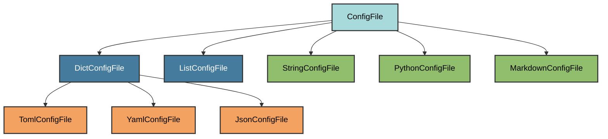

# Configuration System Overview

Pyrig's configuration system provides a declarative, idempotent way to manage all project configuration files. The system automatically creates, validates, and updates configuration files while preserving user customizations.

## Core Concepts

### Declarative Configuration

Each configuration file is managed by a `ConfigFile` subclass that defines:

- **Expected structure**: The minimum required configuration
- **File location**: Where the file should be created
- **File format**: TOML, YAML, JSON, Python, or Markdown
- **Validation rules**: How to check if the file is correct
- **Merge behavior**: How to combine expected and existing configurations

### Subset Validation

Pyrig uses subset validation to preserve user customizations:

- **Users can add**: Extra configuration not defined by pyrig
- **Users cannot remove**: Required configuration defined by pyrig
- **Intelligent merging**: Missing keys are added without removing user additions

### Automatic Discovery

Pyrig automatically discovers all `ConfigFile` subclasses in:

- `pyrig.rig.configs.*` (pyrig's built-in configurations)
- `your_package.rig.configs.*` (your custom configurations)

No registration required - just create a subclass and it's automatically included.

## Configuration File Types

### Base Classes



<ParamField path="ConfigFile" type="abstract base class">
  The root base class providing:
  - Automatic discovery and priority-based validation
  - Subset validation and intelligent merging
  - Cached loading and cache-invalidating dumps
  - Create/validate/merge lifecycle management
</ParamField>

<ParamField path="TomlConfigFile" type="base class">
  For TOML configuration files using tomlkit:
  - Preserves formatting and comments
  - Multiline arrays for readability
  - Used by: pyproject.toml
</ParamField>

<ParamField path="YamlConfigFile" type="base class">
  For YAML configuration files using PyYAML:
  - Safe load/dump (no code execution)
  - Preserves key order
  - Used by: GitHub Actions workflows, mkdocs.yml
</ParamField>

<ParamField path="JsonConfigFile" type="base class">
  For JSON configuration files:
  - 4-space indentation
  - Used by: branch-protection.json, issue templates config
</ParamField>

<ParamField path="PythonConfigFile" type="base class">
  For Python source files:
  - Module docstring preservation
  - Used by: __init__.py files, main.py, CLI scripts
</ParamField>

<ParamField path="MarkdownConfigFile" type="base class">
  For Markdown documentation:
  - Badge generation
  - Template rendering
  - Used by: README.md, CONTRIBUTING.md, docs/*.md
</ParamField>

## Validation Process

### Priority-Based Validation

Configuration files are validated in priority order:

```python
class Priority:
    DEFAULT = 0      # Most config files
    LOW = 10         # Files that depend on defaults
    MEDIUM = 20      # pyproject.toml (others read from it)
    HIGH = 30        # Files that must be created first
```

**Why priority matters**: `pyproject.toml` has priority 20 (MEDIUM) because other configuration files read from it to get project name, dependencies, etc.

### Validation Steps

For each configuration file:

1. **Check existence**: If file doesn't exist, create it
2. **Check correctness**: Validate expected config is subset of actual
3. **Merge configs**: If incorrect, add missing keys/values
4. **Dump merged**: Write merged configuration back to file
5. **Verify**: Confirm file is now correct

### Parallel Execution

Files at the same priority level are validated in parallel using `ThreadPoolExecutor` for performance.

## Usage

### Initialize All Configurations

```bash
uv run pyrig mkroot
```

This command:

1. Discovers all `ConfigFile` subclasses
2. Groups by priority
3. Validates each group in priority order (parallel within groups)
4. Creates missing files and updates incorrect files

### Check Single Configuration

```python
from pyrig.rig.configs.pyproject import PyprojectConfigFile

# Load current configuration
config = PyprojectConfigFile.I.load()

# Get expected configuration
expected = PyprojectConfigFile.I.configs()

# Validate and update if needed
PyprojectConfigFile.I.validate()
```

### Opt Out of Configuration

To opt out of any configuration file, make it empty:

```bash
echo "" > .pre-commit-config.yaml
```

Pyrig detects empty files and skips validation for them.

## Customization

See [Custom Configs](custom-configs) for detailed examples of creating custom configuration files.

### Override Existing Configuration

Create a subclass with the same name in your project's `rig.configs` package:

```python
# myapp/rig/configs/pyproject.py
from pyrig.rig.configs.pyproject import PyprojectConfigFile as BasePyproject
from pyrig.rig.configs.base.base import ConfigDict

class PyprojectConfigFile(BasePyproject):
    """Custom pyproject.toml configuration."""

    def _configs(self) -> ConfigDict:
        """Extend base configuration with custom settings."""
        config = super()._configs()
        # Add custom configuration
        config["project"]["keywords"] = [
            "my-keyword",
            "another-keyword",
        ]
        return config
```

### Add New Configuration File

Create a new `ConfigFile` subclass in your project:

```python
# myapp/rig/configs/custom.py
from pathlib import Path
from pyrig.rig.configs.base.toml import TomlConfigFile
from pyrig.rig.configs.base.base import ConfigDict

class CustomConfigFile(TomlConfigFile):
    """Manages custom.toml configuration."""

    def parent_path(self) -> Path:
        """Place in project root."""
        return Path()

    def _configs(self) -> ConfigDict:
        """Define expected configuration."""
        return {
            "app": {
                "name": "myapp",
                "version": "1.0.0",
            }
        }
```

The file is automatically discovered and validated when you run `uv run pyrig mkroot`.

## Built-in Configurations

Pyrig provides configurations for:

### Project Files

- [pyproject.toml](pyproject) - Python project metadata and dependencies
- [LICENSE](../configs/license_md) - Project license
- [README.md](../configs/readme_md) - Project documentation
- [.gitignore](../configs/gitignore) - Git ignore patterns
- [.python-version](../configs/dot_python_version) - Python version specification
- [.env](../configs/dot_env) - Environment variables template

### GitHub Files

- [GitHub Actions Workflows](github-workflows) - CI/CD automation
- [Branch Protection](branch-protection) - Repository protection rules
- [Issue Templates](../configs/issue_templates/index) - Bug reports and feature requests
- [Pull Request Template](../configs/pull_request_template) - PR description template
- [CONTRIBUTING.md](../configs/contributing) - Contribution guidelines
- [SECURITY.md](../configs/security) - Security policy
- [CODE_OF_CONDUCT.md](../configs/code_of_conduct) - Community guidelines

### Python Package Files

- [__init__.py files](../configs/configs_init) - Package initialization
- [py.typed](../configs/py_typed) - Type information marker
- [main.py](../configs/main) - CLI entry point
- [Subcommands](../configs/subcommands) - CLI command structure

### Testing Files

- [conftest.py](../configs/conftest) - Pytest configuration
- [test_*.py](../configs/test_main) - Test files
- [fixtures](../configs/fixtures_init) - Test fixtures

### Documentation Files

- [mkdocs.yml](../configs/mkdocs) - Documentation site configuration
- [docs/index.md](../configs/index_md) - Documentation homepage
- [docs/api.md](../configs/api_md) - API reference

### Container Files

- [Containerfile](../configs/container_file) - Container image definition

## Best Practices

### Do's

1. **Subclass for customization**: Override `_configs()` in a subclass rather than editing generated files directly
2. **Use priorities correctly**: Set higher priority for files that others depend on
3. **Preserve user additions**: Don't remove keys/values users added
4. **Document custom configs**: Add docstrings explaining why you customized
5. **Test validation**: Run `uv run pyrig mkroot` after creating custom configs

### Don'ts

1. **Don't edit generated files directly**: Changes will be overwritten if they conflict with expected configuration
2. **Don't remove required configuration**: Subset validation will add it back
3. **Don't skip validation**: Always run `uv run pyrig mkroot` after changes
4. **Don't use circular dependencies**: Files should not depend on each other in a cycle
5. **Don't forget to implement required methods**: All abstract methods must be implemented

## Advanced Topics

### Caching

Both `load()` and `configs()` are cached using `@cache` decorator:

- **First call**: Loads/generates configuration
- **Subsequent calls**: Returns cached value
- **Cache invalidation**: Calling `dump()` clears the cache

```python
# First load - reads from disk
config1 = PyprojectConfigFile.I.load()  # Reads file

# Second load - uses cache
config2 = PyprojectConfigFile.I.load()  # Returns cached

# Dump invalidates cache
PyprojectConfigFile.I.dump(config1)  # Clears cache

# Next load reads from disk again
config3 = PyprojectConfigFile.I.load()  # Reads file
```

### Merging Behavior

When merging configurations:

- **Dicts**: Recursively merged (user keys preserved, expected keys added)
- **Lists**: Expected items inserted at same indices if missing
- **Scalars**: Expected value replaces actual if different

### Opt-Out Pattern

Empty files signal opt-out:

```python
def is_unwanted(self) -> bool:
    """Check if user opted out (file exists and is empty)."""
    return self.path().exists() and self.path().stat().st_size == 0
```

This allows users to disable any configuration file without pyrig recreating it.

## Related

- [pyproject.toml Configuration](pyproject)
- [GitHub Workflows](github-workflows)
- [Branch Protection](branch-protection)
- [Custom Configs](custom-configs)
- [Architecture Documentation](architecture)
